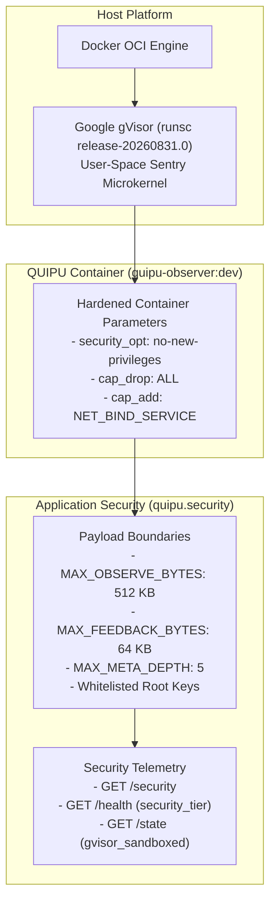

# QUIPU gVisor Sandboxing & Protection Architecture

**Version**: 0.32.0  
**Status**: Integrated & Verified  
**Date**: 2026-09-08  

---

## 1. Overview

QUIPU functions as the cognitive observer and neural annealing axis for the autonomous fleet. Because QUIPU processes live observations and feedback streams from multiple axes (Vision, Touch, Decision Core, Marketplace), it operates with defense-in-depth isolation utilizing Google gVisor (`runsc`) user-space kernel virtualization alongside application-layer payload constraints.



---

## 2. Multi-Tier Security Specifications

### Tier 1: Kernel Isolation via gVisor Sentry
- **Runtime**: `runsc` OCI runtime intercepting and handling Linux system calls in user space.
- **Microkernel**: Sentry handles system calls without direct passthrough to the host Linux kernel, eliminating privilege escalation and kernel exploit surfaces.
- **Environment Detection**: Automatic runtime inspection via `/proc/version` and `/proc/sys/kernel/osrelease` returning `4.19.0-gvisor`.

### Tier 2: Container Boundary Hardening
- **Capabilities Dropped**: `cap_drop: ALL` ensures zero administrative or raw socket capabilities are retained by the process.
- **Privilege Escalation Prevention**: `no-new-privileges: true` blocks `setuid` binaries or sub-processes from acquiring elevated permissions.
- **Port Confinement**: Bound strictly to loopback `127.0.0.1:7100` to prevent unauthenticated lateral network ingress.

### Tier 3: Application-Layer Boundary Checks (`quipu.security`)
- **Payload Size Guards**:
  - `POST /observe`: Maximum 512 KB raw payload, 100,000 characters per text field.
  - `POST /feedback`: Maximum 64 KB raw payload.
- **Structural Integrity & Anti-Nesting**:
  - JSON metadata dictionary depth limited to `5` levels to thwart stack exhaustion and algorithmic complexity denial-of-service attacks.
- **Key Whitelisting**:
  - Input JSON root keys strictly validated against canonical observation schemas (`source`, `text`, `device_id`, `site_id`, `tokens`, `meta`, `timestamp`).

---

## 3. Endpoints & Telemetry

### `GET /security`
Returns active security posture, isolation tier, and payload limits:
```json
{
  "ok": true,
  "gvisor_sandboxed": true,
  "no_new_privileges": true,
  "isolation_tier": "tier-2-hardened-container",
  "platform": "linux",
  "limits": {
    "max_observe_bytes": 524288,
    "max_observe_text_chars": 100000,
    "max_meta_depth": 5,
    "max_feedback_bytes": 65536
  }
}
```

### `GET /health`
Enriched with `gvisor_sandboxed` boolean and `security_tier` string for orchestrator fleet health polling.

---

## 4. Verification Suite

Run the dedicated test suite:
```bash
docker run --rm -v "${PWD}/QUIPU:/app" -w /app quipu-observer:dev pytest tests/test_gvisor_security.py tests/test_observer_service.py
```
- Total test coverage: 12 tests passing across payload boundary rejections, depth overflows, whitelist validations, and security telemetry endpoints.
