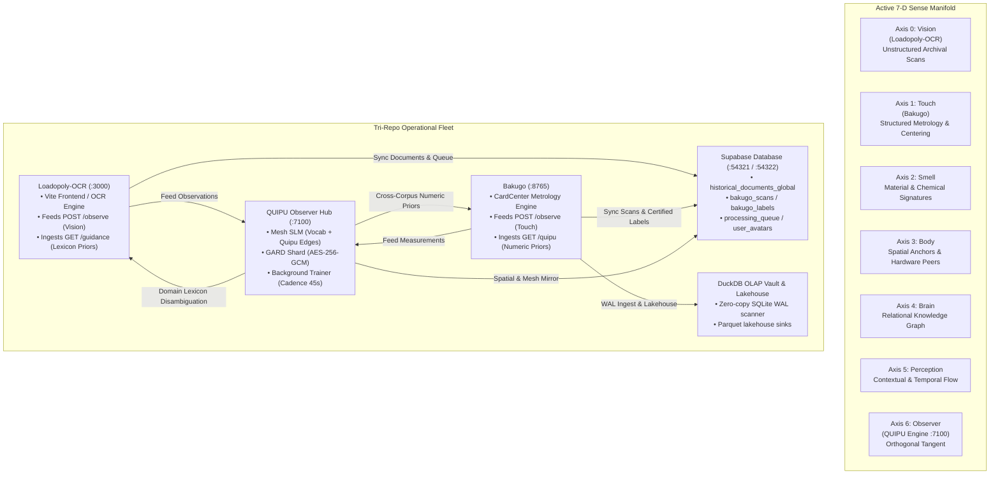

# System Dynamics — QUIPU Entirety & Tri-Repo Mesh

Version: 0.31.0  
Date: 2026-08-22  

> **Lineage & progression.** This model was authored for the Supply-Chain-Architect (SCB) and carried forward, clean-room, into the **QUIPU Entirety**. In **v0.31.0**, the control surface adds **Infodynamic Gravity & Analog Traveling-Wave Cognition** — active bounded priors derived from Vopson's computational universe / entropic gravity ($ig\_multiplier$ quipu edge lift from information compression) and Miller et al.'s traveling-wave spatial computing ($ac\_multiplier$ Kuramoto phase coherence and per-token wave-crest stencil gating).

---

## 1. Purpose

This document describes the QUIPU Entirety and its tri-repo ecosystem as a **system-dynamics model** rather than merely a collection of modular software packages. The goal is to make all control surfaces explicit:
- What physical and cognitive state variables are measured
- What signals get reinforced, damped, or bifurcated
- How dense local memory is separated from sparse frontier reasoning
- How multi-repo sense axes (Vision from Loadopoly-OCR and Touch from Bakugo) interact bidirectionally through QUIPU's shared manifold and Supabase persistence
- How on-demand and background self-annealing iterations mold downstream client applications while keeping external users isolated from root storage

QUIPU operates as a closed-loop attractor system spanning a bounded local memory substrate, a graph/material substrate, and a routed frontier-expansion substrate.

---

## 2. Tri-Repo Sense Architecture

The system coordinates three autonomous repositories mapped to explicit axes of the 7-D sense manifold:



### Sense Axis Mapping

| Sense Axis | Index | Primary Repo / Provider | Data Characteristics | Role in Entirety |
| :--- | :---: | :--- | :--- | :--- |
| **Vision** | 0 | `Loadopoly-OCR` | Unstructured, open-vocabulary archival scans, historical text, GIS coordinates | Broad observation, novel token discovery, lexicon expansion |
| **Touch** | 1 | `Bakugo` | Structured card geometry, mm-level border ratios, closed catalog tokens | Geometric ground truth, error bounding, constraint enforcement |
| **Smell** | 2 | `QUIPU` Internal | Material characteristics, chemical & degradation markers | Substrate condition indexing |
| **Body** | 3 | `QUIPU` / `SCB` Grid | Compute grid peers (Cores, RAM, VRAM), Dev Tunnels | Physical hardware realization & throughput |
| **Brain** | 4 | `QUIPU` / `Supabase` | Relational Knowledge Graph, PostgREST tables, embeddings | Semantic linkage, entity graph, query resolution |
| **Perception**| 5 | `QUIPU` Temporal | Real-time event streams, user sessions, activity pulses | Dynamic awareness and adaptive re-weighting |
| **Observer** | 6 | `QUIPU` Service | 7-D orthogonal tangent, learning cadence, EMA calibration | Cross-corpus arbitration, mesh synthesis, feedback loop |

---

## 3. Primary State Vector

The system state is returned by `system_entirety_state()` in [src/quipu/system_entirety.py](src/quipu/system_entirety.py):

- `axes` — Six active sense amplitudes $[a_0, \dots, a_5]$ after additive injections.
- `observer` — 7th-dimensional scalar tangent orthogonal to the 6-sense hyperplane:
  $$\vec{\Psi}_{7D} = \begin{bmatrix} a_{vision} \\ a_{touch} \\ a_{smell} \\ a_{body} \\ a_{brain} \\ a_{perception} \\ a_{observer} \end{bmatrix}$$
- `magnitude` — Euclidean norm $\|\vec{\Psi}_{7D}\|_2$.
- `material_bifurcation` — Realized physical density, nodal bifurcation, and mesh topology.
- `pim_planning` — Planning-state injections from safety stock, min-max, and lead-time signals.
- `repository_catalog` — Source/capability coverage injected as a modular expansion signal.
- `ueqgm_runtime` — Adaptive runtime overlay built from corpus density, recent learning evidence, and certainty gating.
- `transaction` — Realized bit-flip drive governing state transitions between observer-only, material-bifurcated, and mesh-bifurcated behavior.

---

## 4. Governing Control Equations

### 4.1. Learning Acquisition Drive
Governs how aggressively the learning subsystem pulls in new external tokens:
$$acquisition\_drive = \text{clamp}\Big(0.20 \cdot (1-s) \cdot d + 0.10 \cdot (1-v), 0.0, 1.0\Big)$$

### 4.2. Observer Calibration EMA
Calculated by the QUIPU Observer to guide client confidence thresholds:
$$EMA_{conf}(t) = 0.90 \cdot EMA_{conf}(t-1) + 0.10 \cdot c_t$$
$$suggested\_min\_confidence = \max\Big(0.35, \min\big(0.90, EMA_{conf} - 0.15\big)\Big)$$

### 4.3. Cross-Corpus Frequency Prior (Touch Disambiguation)
Used by Bakugo to separate ambiguous catalog collector numbers based on combined corpus frequency:
$$P_{mesh}(token) = \frac{freq(token)}{\sum_{k \in \mathcal{V}_{numeric}} freq(k)}$$

### 4.4. Information Efficiency & Cramér-Rao Boundary
$$\eta_{info} = \min\left(1.0, \frac{\sigma_{CRB}}{\max(\sigma_{measured}, 10^{-12})}\right)$$

### 4.5. Epistemic Surprise & Rupture Detection
$$\text{Surprise}(t) = \text{clamp}\Big((1 - \text{coverage}) \cdot \text{confidence}, 0.0, 1.0\Big)$$
$$EMA_{surprise}(t) = 0.90 \cdot EMA_{surprise}(t-1) + 0.10 \cdot \text{Surprise}(t)$$

$$\text{Rupture} \iff (\text{coverage} < 0.30 \land \text{confidence} > 0.80) \lor \left(\frac{d}{dt}\text{STP\_gap} > 0 \land \text{loss\_plateau}\right) \lor (\Delta S > \mu_{\Delta S} + 2\sigma_{\Delta S})$$

---

## 5. Dynamical Feedback Loops

### Loop 1: Vision-Touch Closed Loop & Tri-Repo Feedback
1. **Vision Ingestion (`Loadopoly-OCR`)**: Open-vocabulary document text is captured, normalized, and posted to `POST /observe` (routed to `vision` axis).
2. **Mesh Synthesis (`QUIPU`)**: Tokens and quipu bigram edges $(\text{src} \to \text{dst})$ are folded into the shared MESH-SLM.
3. **Touch Disambiguation (`Bakugo`)**: Structured trading card scans pull `GET /guidance?source=bakugo` to obtain numeric priors that break catalog number ties.
4. **Ground-Truth Reinforcement**: Corrections submitted to `POST /feedback` are weighted twice ($2\times$) in the bigram graph to out-compete misreadings.

### Loop 2: GARD Shard Authenticated Channel & Interstitial Entanglement
- Envelopes are sealed with **AES-256-GCM (gard-shard/v2)** with a 16-byte authentication tag and authenticated additional data (AAD).
- Sub-CRB bit covariance across consecutive Weyl states yields the interstitial entanglement score.

### Loop 3: STP Geodesic Diagnostic & Entropy Differential ($\Delta S$)
- Trajectory triplets $(s < r < t)$ are sampled to measure the Semantic-Tube-Prediction gap.
- Concurrently, exact-SQL von Neumann entropy is compared against the mean-field approximation.

### Loop 4: Doc Annealing & Structural Fingerprinting
- `doc_annealing.py` computes a SHA-256 structural fingerprint over version, bridge roots, and density. On structural transitions, `docs/system_entirety_map.md` is annealed and bumped.

### Loop 5: Containerized PostgREST State Mirroring & DuckDB Lakehouse
- `Loadopoly-OCR` and `Bakugo` mirror operational records to Supabase and DuckDB.
- Zero-copy SQLite WAL scanner provides sub-second aggregations.

### Loop 6: World Model Dialectic — Epistemic Rupture & Precedent-Driven Retrieval (v0.29.0)
- Tracks cognitive phase transitions (`receptive_hunger` $\to$ `empirical_precedent` $\to$ `targeted_epistemic` $\to$ `continuous_synthesis`).
- Physical-space grounding enriches observations with information-efficiency metrics ($\eta = \sigma_{CRB} / \sigma_{measured}$) and lossy channel profiles.

### Loop 7: Tri-Repo Epistemic Self-Annealing & Multi-Tenant Firewall (v0.30.0)
- **On-Demand Self-Annealing**: Clients call `POST /anneal` to trigger MESH-SLM self-annealing iterations across the sensory manifold.
- **Client Molding Directives**: `GET /guidance` provides phase-adaptive prompt lexicons for Loadopoly-OCR and Snell refractive priors ($n=1.491, 1.586$) and SPRT sequential boundary limits for Bakugo.
- **Multi-Tenant Device Isolation**: External users querying via `bakugo.loadopoly.com` or `loadopoly.com` are scoped strictly by `device_id` (`WHERE device_id = ?`) preventing unauthorized access to host databases or the shared DuckDB Vault.
- **Contamination Firewall**: Uncertified crowd inputs are recorded as `SELF_REPORTED` and firewalled from ground-truth training datasets.

### Loop 8: Infodynamic Gravity & Analog Traveling-Wave Cognition (v0.31.0)
- **Infodynamic Gravity Coupling (Vopson 2025)**: Negative feedback lift $\mu_{ig} = 1.0 + 0.05 \cdot \text{clamp01}(1.0 - \text{compression})$ accelerates early quipu bigram formation when vocabulary is diffuse, annealing into stable clusters as data compacts. Verified via `infodynamic_trend()`.
- **Analog Traveling-Wave Stencil Gating (Miller et al. 2026)**: Macroscopic Kuramoto phase coherence modulates learning rates by $\pm 5\%$ ($\mu_{ac}$), while mobile traveling wave crests gate per-token embedding nudges by $\text{stencil\_gain} = 0.90 + 0.20 \cdot \text{interaction\_gain}[\text{cell}]$, performing spatial analog arithmetic. Verified via `analog_coherence_trend()`.

---

## 6. Observability & Verification Surfaces

| Metric / Endpoint | Source | Description |
| :--- | :--- | :--- |
| `GET /health` | `QUIPU (:7100)` | Service liveness, vocabulary size, quipu edge count, hideout mesh status |
| `GET /state` | `QUIPU (:7100)` | Mesh SLM summary, STP gap metrics, entropy differential, calibration |
| `GET /guidance?source=X` | `QUIPU (:7100)` | Domain lexicon hints, prompt guidance, refractive priors, retrieval directive |
| `POST /anneal` | `QUIPU (:7100)` | Triggers an on-demand epistemic self-annealing iteration across the mesh |
| `GET /world-model` | `QUIPU (:7100)` | Full world-model dialectic state: phase, surprise EMA, rupture log, retrieval directive |
| `GET /my-scans` | `Bakugo (:8765)` | Tenant-isolated scan records scoped strictly to the request's `X-Device-ID` |
| `GET /my-analytics` | `Bakugo (:8765)` | Tenant-isolated DuckDB OLAP summary metrics scoped to `WHERE device_id = ?` |
| `GET /quipu` | `Bakugo (:8765)` | Internal observer client status, cache TTL, and received guidance |
| `GET /rest/v1/bakugo_scans` | `Supabase (:54321)` | Live PostgREST mirror of card metrology scans |
| `system_entirety_state()` | `QUIPU Python API` | Full 7+1-D state vector, transaction drive, and axis amplitudes |
| `stp_diagnostic_trend()` | `QUIPU Python API` | Rolling P1 geodesic signature and $\Delta S$ anti-correlation |
| `infodynamic_trend()` | `QUIPU Python API` | Second-law-of-infodynamics compression and bit-entropy trend |
| `analog_coherence_trend()` | `QUIPU Python API` | Kuramoto coherence and wave-stencil contrast trend |
| `world_model_state()` | `QUIPU Python API` | Current cognitive phase, acquisition pressure, epistemic surprise, rupture events |

---

## 7. Lineage Summary

```
v0.22.x (SCB Base Lineage) ──► v0.24.1 (Paired Agent Gate) ──► v0.25.0 (STP Geodesic Diagnostic)
                              │
                              └──► v0.27.0 (Control Plane GUI & Tensor Compression)
                              │
                              └──► v0.28.0 (Tri-Repo Closed Loop, AES-256-GCM, & Si/Ci Stability)
                              │
                              └──► v0.29.0 (World Model Dialectic, Epistemic Rupture & Grounding)
                              │
                              └──► v0.30.0 (Tri-Repo Epistemic Self-Annealing & Multi-Tenant Firewall)
                              │
                              └──► v0.31.0 (Infodynamic Gravity & Analog Traveling-Wave Cognition)
```