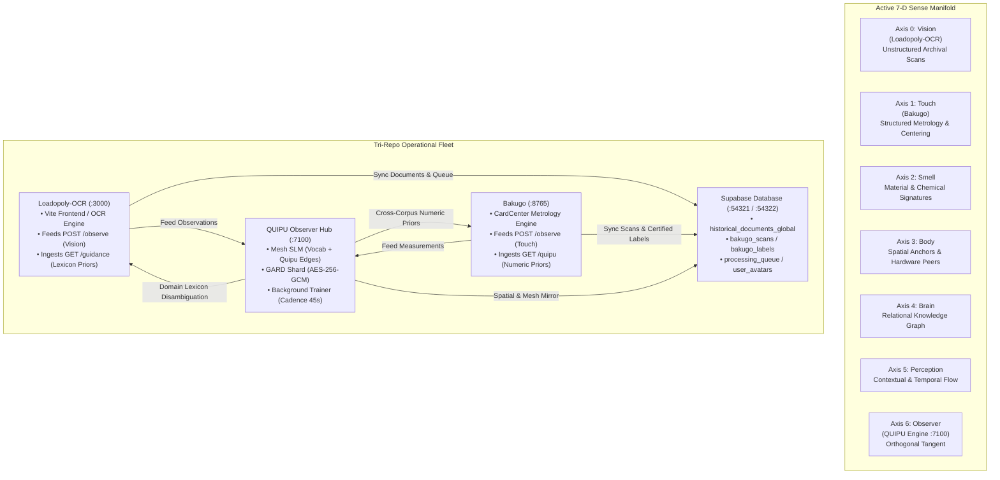

# System Dynamics — QUIPU Entirety & Tri-Repo Mesh

Version: 0.29.0  
Date: 2026-08-20  

> **Lineage & progression.** This model was authored for the Supply-Chain-Architect (SCB) and carried forward, clean-room, into the **QUIPU Entirety**. In **v0.29.0**, the control surface adds **World Model Dialectic** — epistemic rupture detection, precedent-driven learning retrieval, and cognitive phase transitions — to the tri-repo closed-loop mesh. The Observer now tracks when empirical data from Bakugo (Touch) and Loadopoly-OCR (Vision) contradicts its existing corpus priors, triggering conceptual bifurcation and targeted re-acquisition. Physical-space channel grounding from Bakugo and vision-channel grounding from Loadopoly-OCR teach the Observer how information is lost in physical reality vs digital acquisition.

---

## 1. Purpose

This document describes the QUIPU Entirety and its tri-repo ecosystem as a **system-dynamics model** rather than merely a collection of modular software packages. The goal is to make all control surfaces explicit:
- What physical and cognitive state variables are measured
- What signals get reinforced, damped, or bifurcated
- How dense local memory is separated from sparse frontier reasoning
- How multi-repo sense axes (Vision from Loadopoly-OCR and Touch from Bakugo) interact bidirectionally through QUIPU's shared manifold and Supabase persistence

QUIPU operates as a closed-loop attractor system spanning a bounded local memory substrate, a graph/material substrate, and a routed frontier-expansion substrate.

---

## 2. Tri-Repo Sense Architecture

The system coordinates three autonomous repositories mapped to explicit axes of the 7-D sense manifold:



### Sense Axis Mapping

| Sense Axis | Index | Primary Repo / Provider | Data Characteristics | Role in Entirety |
| :--- | :---: | :--- | :--- | :--- |
| **Vision** | 0 | `Loadopoly-OCR` | Unstructured, open-vocabulary archival scans, historical text, GIS coordinates | Broad observation, novel token discovery, lexicon expansion |
| **Touch** | 1 | `Bakugo` | Structured card geometry, mm-level border ratios, closed catalog tokens | Geometric ground truth, error bounding, constraint enforcement |
| **Smell** | 2 | `QUIPU` Internal | Material characteristics, chemical & degradation markers | Substrate condition indexing |
| **Body** | 3 | `QUIPU` / `SCB` Grid | Compute grid peers (Cores, RAM, VRAM), Dev Tunnels | Physical hardware realization & throughput |
| **Brain** | 4 | `QUIPU` / `Supabase` | Relational Knowledge Graph, PostgREST tables, embeddings | Semantic linkage, entity graph, query resolution |
| **Perception**| 5 | `QUIPU` Temporal | Real-time event streams, user sessions, activity pulses | Dynamic awareness and adaptive re-weighting |
| **Observer** | 6 | `QUIPU` Service | 7-D orthogonal tangent, learning cadence, EMA calibration | Cross-corpus arbitration, mesh synthesis, feedback loop |

---

## 3. Primary State Vector

The system state is returned by `system_entirety_state()` in [src/quipu/system_entirety.py](src/quipu/system_entirety.py):

- `axes` — Six active sense amplitudes $[a_0, \dots, a_5]$ after additive injections.
- `observer` — 7th-dimensional scalar tangent orthogonal to the 6-sense hyperplane:
  $$\vec{\Psi}_{7D} = \begin{bmatrix} a_{vision} \\ a_{touch} \\ a_{smell} \\ a_{body} \\ a_{brain} \\ a_{perception} \\ a_{observer} \end{bmatrix}$$
- `magnitude` — Euclidean norm $\|\vec{\Psi}_{7D}\|_2$.
- `material_bifurcation` — Realized physical density, nodal bifurcation, and mesh topology.
- `pim_planning` — Planning-state injections from safety stock, min-max, and lead-time signals.
- `repository_catalog` — Source/capability coverage injected as a modular expansion signal.
- `ueqgm_runtime` — Adaptive runtime overlay built from corpus density, recent learning evidence, and certainty gating.
- `transaction` — Realized bit-flip drive governing state transitions between observer-only, material-bifurcated, and mesh-bifurcated behavior.

---

## 4. Governing Control Equations

### 4.1. Learning Acquisition Drive
Governs how aggressively the learning subsystem pulls in new external tokens:
$$acquisition\_drive = \text{clamp}\Big(0.20 \cdot (1-s) \cdot d + 0.10 \cdot (1-v), 0.0, 1.0\Big)$$
Where:
- $s \in [0, 1]$ is corpus saturation.
- $d \in [0, 1]$ is task difficulty / novelty.
- $v \in [0, 1]$ is current learning velocity.

### 4.2. Observer Calibration EMA
Calculated by the QUIPU Observer to guide client confidence thresholds:
$$EMA_{conf}(t) = 0.90 \cdot EMA_{conf}(t-1) + 0.10 \cdot c_t$$
$$suggested\_min\_confidence = \max\Big(0.35, \min\big(0.90, EMA_{conf} - 0.15\big)\Big)$$

### 4.3. Cross-Corpus Frequency Prior (Touch Disambiguation)
Used by Bakugo to separate ambiguous catalog collector numbers based on combined corpus frequency:
$$P_{mesh}(token) = \frac{freq(token)}{\sum_{k \in \mathcal{V}_{numeric}} freq(k)}$$

### 4.4. Transaction Drive
Turns multi-sense potential into systemic state change:
$$transaction\_drive = 0.42 \cdot observer + 0.18 \cdot nodal\_bifurcation + 0.14 \cdot mesh\_density + 0.10 \cdot planning + 0.08 \cdot catalog + 0.16 \cdot symbiotic\_drive$$

### 4.5. Harmonic Si/Ci Numerical Stability (v0.28.0)
The sine and cosine integral evaluations in `ueqgm_engine.py` are stabilized using Taylor series expansion for $|x| < 2.0$ and modified-Lentz continued fractions for $|x| \ge 2.0$:
$$\text{Si}(x) = \sum_{n=0}^{\infty} \frac{(-1)^n x^{2n+1}}{(2n+1)(2n+1)!}$$
$$\text{Ci}(x) = \gamma + \ln|x| + \sum_{n=1}^{\infty} \frac{(-1)^n x^{2n}}{2n(2n)!}$$
Eliminates divergence past $|\varphi| \sim 2\pi$ where legacy polynomial approximations failed.

---

## 5. Dynamical Feedback Loops

### Loop 1: Vision-Touch Closed Loop & Tri-Repo Feedback
1. **Vision Ingestion (`Loadopoly-OCR`)**: Open-vocabulary document text is captured, normalized, and posted to `POST /observe` (routed to `vision` axis).
2. **Mesh Synthesis (`QUIPU`)**: Tokens and quipu bigram edges $(\text{src} \to \text{dst})$ are folded into the shared MESH-SLM.
3. **Touch Disambiguation (`Bakugo`)**: Structured trading card scans pull `GET /guidance?source=bakugo` to obtain numeric priors that break catalog number ties.
4. **Ground-Truth Reinforcement**: Corrections submitted to `POST /feedback` are weighted twice ($2\times$) in the bigram graph to out-compete misreadings.

### Loop 2: GARD Shard Authenticated Channel & Interstitial Entanglement
- Envelopes are sealed with **AES-256-GCM (gard-shard/v2)** with a 16-byte authentication tag and authenticated additional data (AAD).
- The lossy GARD tier acts as an asymmetric beam splitter. Sub-CRB bit covariance across consecutive Weyl states yields the **interstitial entanglement score**:
$$E = \frac{|C_{01} \cdot C_{12} - C_{02}|}{1 + |C_{02}|}$$
- Lifts effective learning rate by multiplier $\mu_{ie} = 1 + 0.05 \cdot E$.

### Loop 3: STP Geodesic Diagnostic & Entropy Differential ($\Delta S$)
- Trajectory triplets $(s < r < t)$ are sampled to measure the Semantic-Tube-Prediction gap:
$$\text{Gap}_{STP} = 1 - \cos(h_t - h_r, h_r - h_s)$$
- Concurrently, the exact-SQL von Neumann entropy is compared against the mean-field approximation:
$$\Delta S = S_{exact} - S_{mean\_field}$$
- Anti-correlation between $\Delta S$ and the torus gap ($|\rho| \ge 0.5 \cdot \Omega_\Lambda$) confirms that geodesic placement performs real semantic compression.

### Loop 4: Doc Annealing & Structural Fingerprinting
- `doc_annealing.py` computes a SHA-256 structural fingerprint over:
$$\text{Fingerprint} = \text{SHA256}\big(\text{version} \,\|\, \text{bridge\_root} \,\|\, \text{mesh\_density} \,\|\, \text{certainty} \,\|\, \text{bifurcation}\big)$$
- On structural transitions, `docs/system_entirety_map.md` is annealed and bumped, ensuring documentation tracks live topology without thrashing.

### Loop 5: Containerized PostgREST State Mirroring
- `Loadopoly-OCR` and `Bakugo` mirror operational records to Supabase (`bakugo_scans`, `bakugo_labels`, `historical_documents_global`, `processing_queue`).
- Row Level Security (RLS) policies and contamination firewalls guarantee that only verified, cert-backed records can train downstream outcome models.

### Loop 6: World Model Dialectic — Epistemic Rupture & Precedent-Driven Retrieval (v0.29.0)
The Observer maintains a world-model surface (`src/quipu/world_model.py`) that tracks the dialectic between top-down corpus priors and bottom-up empirical sensorium:

**Phase transitions** — the system moves through four cognitive phases as empirical precedent accumulates:
$$\text{phase}(d) = \begin{cases}
\text{receptive\_hunger}      & d < 0.2 \\
\text{empirical\_precedent}   & 0.2 \le d < 0.6 \\
\text{targeted\_epistemic}    & 0.6 \le d < 0.85 \\
\text{continuous\_synthesis}  & d \ge 0.85
\end{cases}$$
where $d \in [0, 1]$ is precedent depth (accumulated empirical coverage). A major rupture ($\text{surprise} > 0.8$) resets to `receptive_hunger`.

**Epistemic surprise** is computed per observation as the product of token novelty and sensor confidence:
$$\text{surprise} = \text{clamp}\big((1 - \text{coverage}) \cdot \text{confidence}, 0, 1\big)$$
tracked via EMA: $\text{EMA}_s(t) = 0.9 \cdot \text{EMA}_s(t{-}1) + 0.1 \cdot s_t$

**Rupture detection** triggers when any of three conditions hold:
1. **High novelty + high confidence**: $\text{coverage} < 0.3 \land \text{confidence} > 0.8$ — the sensor is certain about something the mesh has never seen.
2. **STP geodesic divergence**: STP torus gap slope $> 0$ while loss is plateaued — the learned embedding cannot explain new trajectories.
3. **Entropy differential spike**: $\Delta S > \bar{\mu}_{\Delta S} + 2\sigma_{\Delta S}$ — the graph's information structure is being disrupted beyond normal variance.

**Retrieval directives** are generated per phase to steer the learning retriever:
| Phase | Strategy | Confidence Floor | Focus |
| :--- | :--- | :---: | :--- |
| `receptive_hunger` | `broad_exploration` | 0.20 | Unstructured vision, novel structures |
| `empirical_precedent` | `precedent_building` | 0.50 | Established patterns, cross-corpus correlations |
| `targeted_epistemic` | `targeted_gap_closing` | 0.70 | STP divergence areas, low-confidence nodes |
| `continuous_synthesis` | `synthesis_verification` | 0.85 | Edge cases, high-entropy boundaries |

**Physical-space grounding** — Bakugo enriches touch observations with information-efficiency metrics ($\eta = \sigma_{CRB} / \sigma_{measured}$) and lossy channel profiles (blur, refraction, glare) so the Observer learns the physics of information loss in physical card measurement. Loadopoly-OCR enriches vision observations with document degradation factors (ink fading, archaic typography) and lexicon coverage metrics.

---

## 6. Observability & Verification Surfaces

| Metric / Endpoint | Source | Description |
| :--- | :--- | :--- |
| `GET /health` | `QUIPU (:7100)` | Service liveness, vocabulary size, quipu edge count, hideout mesh status |
| `GET /state` | `QUIPU (:7100)` | Mesh SLM summary, STP gap metrics, entropy differential, calibration |
| `GET /guidance?source=X` | `QUIPU (:7100)` | Domain lexicon hints + world model state + retrieval directive |
| `GET /world-model` | `QUIPU (:7100)` | Full world-model dialectic state: phase, surprise EMA, rupture log, retrieval directive |
| `GET /quipu` | `Bakugo (:8765)` | Internal observer client status, cache TTL, and received guidance |
| `GET /rest/v1/bakugo_scans` | `Supabase (:54321)` | Live PostgREST mirror of card metrology scans |
| `system_entirety_state()` | `QUIPU Python API` | Full 7+1-D state vector, transaction drive, and axis amplitudes |
| `stp_diagnostic_trend()` | `QUIPU Python API` | Rolling P1 geodesic signature and $\Delta S$ anti-correlation |
| `world_model_state()` | `QUIPU Python API` | Current cognitive phase, acquisition pressure, epistemic surprise, rupture events |

---

## 7. Lineage Summary

```
v0.22.x (SCB Base Lineage) ──► v0.24.1 (Paired Agent Gate) ──► v0.25.0 (STP Geodesic Diagnostic)
                              │
                              └──► v0.27.0 (Control Plane GUI & Tensor Compression)
                              │
                              └──► v0.28.0 (Tri-Repo Closed Loop, AES-256-GCM, & Si/Ci Stability)
                              │
                              └──► v0.29.0 (World Model Dialectic, Epistemic Rupture & Grounding)
```