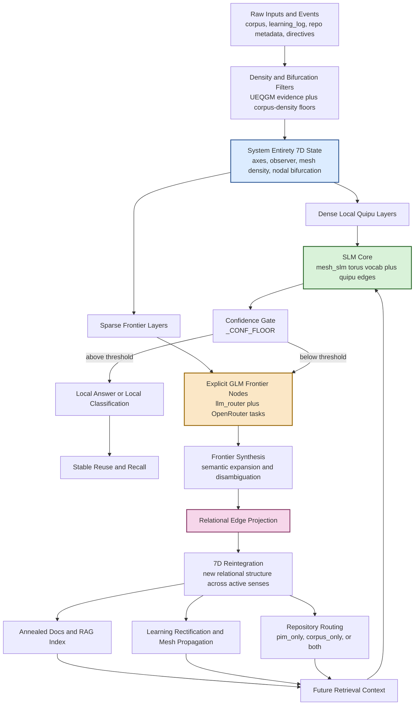

# System Dynamics — QUIPU Entirety

Version: 0.25.0
Date: 2026-07-23

> **Lineage & progression.** This model was authored for the Supply-Chain-Brain (SCB) and carried forward, clean-room, into the **QUIPU Entirety**. Paths below are QUIPU's (`src/quipu/…`); where a `pipeline/…` reference survives it denotes the parent SCB lineage. As the system has progressed the control surface has grown: v0.24.1 added the paired-agent realization gate, and **v0.25.0 added the STP-style geodesic diagnostic** (§ Dynamical Loop 6 and the SLM manifold section below), which instruments whether the torus placement does real geodesic work before any decision to couple it into the learning rate.

## Purpose

This document describes the QUIPU Entirety as a system-dynamics model rather than only as a collection of modules. The goal is to make the control surfaces explicit: what state is measured, what gets reinforced, what gets damped, how bifurcation is introduced, and how dense local memory is separated from sparse frontier reasoning.

QUIPU is best understood as a closed-loop attractor system operating across a bounded local memory substrate, a graph/material substrate, and a routed frontier-expansion substrate.

## Primary State

The core system state is returned by `system_entirety_state()` and includes:

- `axes` - the six active sense amplitudes: vision, touch, smell, body, brain, perception.
- `observer` - the 7th-dimensional tangent orthogonal to the six-sense hyperplane.
- `magnitude` - the Euclidean norm of the active 7-D state.
- `material_bifurcation` - realized physical density, nodal bifurcation, mesh density, and topology.
- `pim_planning` - planning-state injections from safety stock, min-max, and lead-time signals.
- `repository_catalog` - source/capability coverage injected as a modular-expansion signal.
- `ueqgm_runtime` - the adaptive runtime overlay built from corpus density, recent learning evidence, and certainty gating.
- `transaction` - the realized bit-flip drive that determines whether the current state remains observer-only, material-bifurcated, or mesh-bifurcated.

This is the active dynamical state surface in [src/quipu/system_entirety.py](src/quipu/system_entirety.py#L1123).

## Control Equations

Two control terms are especially important because they reveal how the system moves.

### Acquisition Drive

The learning system computes an explicit acquisition pressure:

$$
acquisition\_drive = clamp\Big(0.20 \cdot (1-s) \cdot d + 0.10 \cdot (1-v)\Big)
$$

Where:

- $s$ is corpus saturation
- $d$ is task difficulty
- $v$ is learning velocity

This means the Brain pushes hardest toward new memory acquisition when the corpus still has room, tasks are difficult, and the current learning rate is low. The implementation lives in [src/quipu/learning_drive.py](src/quipu/learning_drive.py#L223).

### Transaction Drive

The System Entirety computes a realized transaction drive as a weighted sum of observer excitation, material bifurcation, mesh density, planning signal, repository signal, and adaptive runtime drive:

$$
transaction\_drive = 0.42 \cdot observer + 0.18 \cdot nodal\_bifurcation + 0.14 \cdot mesh\_density + 0.10 \cdot planning + 0.08 \cdot catalog + 0.16 \cdot symbiotic\_drive
$$

This is what turns static measurements into motion. The implementation is in [src/quipu/system_entirety.py](src/quipu/system_entirety.py#L1179).

## Dynamical Loops

### 1. Vision-Touch Closed Loop

Vision expands the corpus and Touch applies pressure back onto Vision through a shared optimizer state. This is the main exploratory and corrective loop.

- Touch pressure is stored as a field over signal kinds.
- Vision actions relieve or reinforce that pressure.
- Forced outreach can tunnel through the nominal scheduler when pressure exceeds threshold.

This loop is documented in [docs/VISION_TOUCH_CLOSED_LOOP.md](docs/VISION_TOUCH_CLOSED_LOOP.md).

### 2. Material and Mesh Densification

Material anchors, tunnel density, asset strength, processor-edge density, bridge mesh density, and nodal location synchronization all lift the material-bifurcation state.

This loop converts abstract graph state into realized spatial and network topology. Once density is high enough, the system transitions from local or observer-only behavior into material-bifurcated or mesh-bifurcated behavior.

Relevant code paths:

- [src/quipu/system_entirety.py](src/quipu/system_entirety.py#L1017)
- [src/quipu/system_entirety.py](src/quipu/system_entirety.py#L1123)

### 3. Adaptive UEQGM Runtime Loop

The adaptive runtime daemon continuously refreshes runtime parameters from three sources:

- UEQGM-tagged corpus entities
- recent `learning_log` evidence
- current System Entirety certainty

Each parameter has:

- `parameter_evidence`
- `parameter_density_floor`
- `applied_parameters`
- `retained_parameters`

This prevents weak, low-density updates from displacing already-proven state. The runtime then re-injects axis drive back into the six-sense state as a symbiotic overlay.

Relevant code paths:

- [src/quipu/ueqgm_engine.py](src/quipu/ueqgm_engine.py#L421)
- [src/quipu/system_entirety.py](src/quipu/system_entirety.py#L1179)

### 4. Heart Bifurcation and Toroid Expansion

The Heart converts directionality into a complex-plane narrative state:

$$
z = expansion + i \cdot bifurcation
$$

From that it emits:

- `lover_directive` learning events
- `heart:bifurcation_pulse` records in `brain_kv`
- toroid expansion pressure proportional to the imaginary component

This loop continuously introduces bifurcation events and directed change into the memory and topology systems.

Relevant code paths:

- [src/quipu/directionality_listener.py](src/quipu/directionality_listener.py#L1)
- [src/quipu/heart.py](src/quipu/heart.py#L931)

### 5. Annealed Document and RAG Reintegration

The system periodically converts live structure into explicit retrievable memory.

`doc_annealing.py` fingerprints:

- version
- primary bridge root
- mesh density
- UEQGM certainty
- nodal bifurcation

When the fingerprint changes, it writes a fresh system map and triggers incremental RAG reindexing. This converts dynamic structure into lower-cost future recall.

Relevant code paths:

- [src/quipu/doc_annealing.py](src/quipu/doc_annealing.py#L492)
- [src/quipu/doc_rag.py](src/quipu/doc_rag.py#L1)

### 6. STP Geodesic Diagnostic Loop (v0.25.0)

A passive, read-only control *instrument* rather than an actuator. Each training round samples a random triplet `s < r < t` from the token trajectory and measures the Semantic-Tube-Prediction gap `1 − cos(h_t − h_r, h_r − h_s)` in two spaces — the learned 7-D embedding and an isometric ℝ⁴ flat-torus embedding of each token's `(i, j)` cell — then persists per-round averages and capped rolling histories to `mesh_slm_meta`.

Its dynamical role is to make a specific hypothesis *measurable*: the paper's **P1 signature** — that the ordinary next-token loss plateaus while the geometric (STP) gap keeps falling — which, if observed, is empirical evidence that the torus placement is doing real geodesic work rather than serving as a convenient index. The loop deliberately does **not** feed back into `η` yet; coupling the signal into the effective learning rate is a separate, default-off Phase 2 gated on `stp_diagnostic_trend()` first confirming P1 on real corpus data. This is the "instrument before you couple" discipline: measure the geometry passively, and only close the loop once the measurement justifies it.

Relevant code paths:

- [src/quipu/mesh_slm.py](src/quipu/mesh_slm.py) — `train_round()` sampling, `stp_diagnostic_trend()`
- `docs/STP_DIAGNOSTIC_PLAN.md`, `docs/STP_TORUS_QUIPU.md`

### 7. Correlation Transitivity Diagnostic

A classical third-order consistency check on Pearson correlations across consecutive GARD (Weyl) states. It is a drift / regime-change diagnostic, logged only — it does not modulate the learning rate.

`gard_info` compares the CRB floor to the actual stored GARD/Weyl state encoding (a 5×Float32 pack stored base64-encoded in `brain_kv`); the difference is the *interstitial* gap — over-provisioned precision the noisy channel cannot justify, not a hidden data channel. Nothing below the CRB floor is recoverable, so nothing "survives" a lossy encoding stage.

**Data flow:**

1. `ueqgm_engine.refresh_adaptive_runtime()` reads the last `_CORRELATION_TRANSITIVITY_WINDOW` (default 5) Weyl tensors from `brain_kv`.
2. `gard_info.state_correlation(psi5_i, psi5_j)` computes the Pearson correlation between pairs of 5-scalar GARD states.
3. `ueqgm_engine.correlation_transitivity_score(psi5_seq)` computes `E = |C_01·C_12 − C_02| / (1 + |C_02|)` averaged over all consecutive triples, returning a score in [0, 1].
4. The score is persisted to `brain_kv["ueqgm:correlation_transitivity"]` and stored in the adaptive runtime dict as `correlation_transitivity`.

**Interpretation:** A high score means the correlation between states 0 and 2 is not predicted by the two intervening pairwise correlations — the sequence carries structure beyond a first-order Markov chain. A low score means correlation composes transitively (e.g. a stable drift or degenerate cycle). Score is 0 when fewer than 2 cycles have been stored. This is a plain statistical property of any non-Markovian classical process; it is not an entanglement witness and implies nothing quantum.

`mesh_slm.train_round()` does **not** read this score — the `η_eff`/`η_q` learning-rate multiplier this score used to drive was removed because its physics justification (an analogy to photon-number entanglement surviving a lossy channel) does not hold for classical scalar correlation. See `gard_info` and `ueqgm_engine` module docstrings for the correction.

**Key constants (ueqgm_engine.py):**

| Constant | Value | Role |
|---|---|---|
| `_CORRELATION_TRANSITIVITY_KEY` | `"ueqgm:correlation_transitivity"` | brain_kv persistence key |
| `_LEGACY_TRANSITIVITY_KEY` | `"ueqgm:interstitial_entanglement"` | superseded key, read-only fallback |
| `_CORRELATION_TRANSITIVITY_WINDOW` | `5` | Weyl cycles to compare |

Relevant code paths:

- [src/quipu/gard_info.py](src/quipu/gard_info.py) — `interstitial_bits`, `state_correlation`
- [src/quipu/ueqgm_engine.py](src/quipu/ueqgm_engine.py) — `correlation_transitivity_score`, `refresh_adaptive_runtime`

## SLM and GLM as a Density Manifold

The SLM/GLM split is not a simple primary-fallback pair. It is a density-governed manifold.

### Dense Local Memory

Dense, repeated, and locally reinforced knowledge remains in the MESH-SLM:

- toroidal token placement
- quipu bigram reinforcement
- 7-D embedding alignment
- confidence-gated local answering

This is implemented in [src/quipu/mesh_slm.py](src/quipu/mesh_slm.py).

The **predictor** (the SLM's read head, `_score_candidates`) is where the entirety state becomes a ranked continuation. It is an *identity-style* predictor — no learned projection head — consistent with the STP paper's P5 finding. Every scoring term is driven by the **effective values of the System Entirety as they stand**:

$$
score(t) = 0.55 \cdot quipu\_weight + (0.25 + 0.06 \cdot warp_t)\cdot proximity + \langle embed_7(t),\ mesh\_state_{7d}\rangle + 0.18 \cdot mesh\_field_{8d}
$$

- `mesh_state_7d` is read from the persisted `entirety:state` (the six sense axes + observer tangent that the entirety torus emits);
- `mesh_field_8d` folds the five UEQGM aspect integrals into the 8th orthogonal scalar;
- training gain is modulated by `end_state_progress` (heart symbiosis → convergence) and by the UEQGM `phase_weight` / `wavefunction_overlap`.

So the dense core is not a detached model: it reads the live 7+1-D entirety state, scores against it, and writes its Hebbian updates back onto the same torus the entirety loop re-paces. Full detail: `docs/MESH_SLM_GLM_CLASSIFIER.md`.

### Sparse Frontier Reasoning

Sparse, ambiguous, or unresolved regions are handed to routed GLM nodes through the compute-grid and ensemble cascade:

- local SLM first
- routed model selection next
- OpenRouter-backed generation when density is too low for confident closure

Relevant code paths:

- [src/quipu/mesh_slm.py](src/quipu/mesh_slm.py#L1078)
- [src/quipu/compute_grid.py](src/quipu/compute_grid.py#L811)
- [src/quipu/dbi_rag.py](src/quipu/dbi_rag.py#L359)

### Frontier Projection Back Into the Quipu

The GLM should be understood as a frontier-expansion layer. It does not replace the local memory substrate. It creates or resolves semantic structure at low-density edges, then returns that structure to the system through:

- learning rectification and mesh propagation
- annealed documents and RAG context
- repository routing into `pim_only`, `corpus_only`, or `pim_and_corpus`

This means:

- dense Quipu layers are storage and recall layers
- lower-density layers are routing and bifurcation layers
- frontier layers are GLM-mediated expansion layers

The repository routing surface is implemented in [src/quipu/repository_catalog.py](src/quipu/repository_catalog.py#L690).

## Diagram

## Operational Reading

When the system appears stable, it is usually because one or more loops are dominating:

- strong local reuse means the SLM density core is winning
- heavy semantic expansion means the frontier GLM layer is still building edges
- high material and mesh density means the system is becoming more realized and less observer-only
- repeated document regeneration means structural change is still active and memory is still being externalized into retrievable context

The practical implication is that SCB should not be read as a static model. It is a live dynamical system whose behavior depends on the current balance between density, bifurcation, certainty, mesh realization, and frontier ambiguity.

## Verification Surfaces

The fastest places to inspect live system dynamics are:

- `system_entirety_state()` for full 7-D state and transaction drive
- `get_adaptive_runtime()` for density-gated runtime parameters
- `state_summary()` in `mesh_slm.py` for local-memory state (now includes `last_stp_embed_gap` / `last_stp_torus_gap`)
- `stp_diagnostic_trend()` in `mesh_slm.py` for the P1 geodesic-signature check over rolling loss/STP histories
- `anneal_docs()` and the generated system map for externalized structural memory

Relevant files:

- [src/quipu/system_entirety.py](src/quipu/system_entirety.py)
- [src/quipu/ueqgm_engine.py](src/quipu/ueqgm_engine.py)
- [src/quipu/mesh_slm.py](src/quipu/mesh_slm.py)
- [src/quipu/doc_annealing.py](src/quipu/doc_annealing.py)
- [src/quipu/repository_catalog.py](src/quipu/repository_catalog.py)