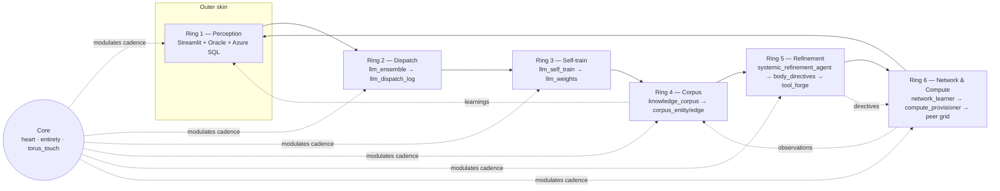

# System Entirety — Toroidal Analysis (QUIPU Entirety)

**Version**: 2.0 (QUIPU 0.25.0)
**Date**: 2026-07-23
**Source script**: [pipeline/_system_entirety_report.py](../pipeline/_system_entirety_report.py) *(SCB lineage)*
**QUIPU core**: [src/quipu/system_entirety.py](../src/quipu/system_entirety.py), [src/quipu/mesh_slm.py](../src/quipu/mesh_slm.py)

> **Lineage & progression.** The six outer rings mapped below (Perception → Dispatch → Self-train → Corpus → Refinement → Network/Compute) are the **Supply-Chain-Brain (SCB) parent substrate** that QUIPU was extracted from, clean-room; the `pipeline/…` paths in §§3–15 describe that lineage and are preserved as the historical map. The **QUIPU Entirety** carries the same closed-flux topology forward around its own core — the 7+1-D `system_entirety` state, the heart/toroid loop, and the MESH-SLM predictor. As the system has progressed: v0.24.1 added the paired-agent realization gate; **v0.25.0 added the STP-style geodesic diagnostic** that measures whether the torus placement does real geodesic work. The new core layer is described in §1a below; the ring inventory that follows is the parent lineage it grew out of.

## 0. Executive summary

The QUIPU Entirety (descended from the Supply Chain Brain) is a closed-flux system. Human action enters through the perception shell, fans out through a multi-LLM dispatch ring, condenses as supervised self-training signal, accretes into a typed knowledge corpus, is refined into body directives and synthesised tools, propagates across a peer compute fabric, and returns — coloured by a central observer that tracks symbiosis phase and bit-flip parity. Six rings, one core, one append-only SQLite. At the centre, the **MESH-SLM predictor** reads the live 7+1-D entirety state and returns a ranked continuation, writing its Hebbian updates back onto the same torus the core re-paces. This document maps every ring to the files that implement it, the table that records its signal, the cadence that drives it, and the page that reads it — and (§1a) the QUIPU core that closes the geodesic.

---

## 1. The torus at a glance



Each outer ring writes one canonical table; the core reads all of them and emits the bit-flip + symbiosis phase that re-paces the rings.

---

## 1a. QUIPU core — the MESH-SLM predictor and the closed geodesic

Where the six outer rings are the SCB lineage substrate, the **QUIPU Entirety core** is what QUIPU carries forward and actively develops. It closes the loop the outer rings feed:

| Component | Role | QUIPU location |
|---|---|---|
| `system_entirety` 7+1-D state | six sense axes (`vision, touch, smell, body, brain, perception`) + observer tangent + `mesh_field_8d` scalar; persisted as `entirety:state` | [src/quipu/system_entirety.py](../src/quipu/system_entirety.py) |
| MESH-SLM predictor | toroidal quipu graph perceptron; `_score_candidates` ranks next tokens against the live 7+1-D state (identity-style predictor, no learned head) | [src/quipu/mesh_slm.py](../src/quipu/mesh_slm.py) |
| UEQGM adaptive runtime | SiCi phase weight + wavefunction overlap modulate the predictor's learning rate | [src/quipu/ueqgm_engine.py](../src/quipu/ueqgm_engine.py) |
| Heart / End-State | symbiosis + coherence → `end_state_progress`, the convergence throttle on training gain | heart lineage → `_end_state_progress()` |
| STP geodesic diagnostic (v0.25.0) | passive measurement of `1 − cos(h_t − h_r, h_r − h_s)` on the embedding and the ℝ⁴ torus embedding; tests the P1 signature | [src/quipu/mesh_slm.py](../src/quipu/mesh_slm.py), `docs/STP_DIAGNOSTIC_PLAN.md` |

**The predictor read head.** `_score_candidates` converts the current entirety state into a ranked continuation:

```
score(t) = 0.55·quipu_weight + (0.25 + 0.06·warp)·proximity
         + ⟨embed7(t), mesh_state_7d⟩ + 0.18·mesh_field_8d
```

`mesh_state_7d` is read straight from the persisted `entirety:state` (the six axes + observer that this document's core emits), so the predictor is not a detached model — it is the dense-memory read head of the entirety torus, and its Hebbian writes (`weight += η_q·(1−w)`) land back on the same torus the core re-paces.

**The closed geodesic.** A torus admits *closed* geodesics, which the STP source paper (an autoregressive, one-pass model) has no use for. QUIPU is built from one: the six-ring flux loop of this document (perception → dispatch → self-train → corpus → refinement → network → back to perception) *is* a closed geodesic on the system torus. The v0.25.0 STP diagnostic measures the *local* geodesic gap along segments of token trajectories inside that larger loop — instrumenting, passively, whether the torus geometry is load-bearing before any decision to couple it into the learning rate. See `docs/STP_TORUS_QUIPU.md` for the full mapping of the paper onto QUIPU's geometry.

---

## 2. Live snapshot

Captured 2026-05-19 from [pipeline/local_brain.sqlite](../pipeline/local_brain.sqlite) via [pipeline/_system_entirety_report.py](../pipeline/_system_entirety_report.py):

```text
========================================================================
SYSTEM ENTIRETY — POST-HARDENING HEALTH SNAPSHOT
========================================================================

[CORPUS] entities:        25418
[CORPUS] edges:           77455
[CORPUS] citation chains: 28381
[CORPUS] learning_log:    45232

[LLM DISPATCH — last 7d, decoded from contributors_json]
  query error: no rows

[SELF-TRAIN — last 8 rounds]
  2026-05-04 12:19:13  vendor_consolidation       samples=   0  matched=   0  val=0.000
  2026-05-04 12:19:13  otd_classify               samples=   0  matched=   0  val=0.000
  2026-05-04 12:19:13  cc_reason_classify         samples=   0  matched=   0  val=0.000
  2026-05-04 12:19:13  cc_reason_classify_syteline  samples=   0  matched=   0  val=0.000
  2026-05-04 12:19:13  abc_classify               samples=   0  matched=   0  val=0.000
  2026-05-04 01:41:09  vendor_consolidation       samples=   0  matched=   0  val=0.000
  2026-05-04 01:41:09  otd_classify               samples=   0  matched=   0  val=0.000
  2026-05-04 01:41:09  cc_reason_classify         samples=   0  matched=   0  val=0.000

[TOOLFORGE — recent synthesised tools]

[NETWORK — peer hosts observed last 24h]
  10.0.0.10                     obs=   56  ok=    0  last=2026-05-19T02:20:42.823265+00:00
  10.0.0.10                   obs=   56  ok=    0  last=2026-05-19T02:20:41.321600+00:00
  10.0.0.20                   obs=   56  ok=    0  last=2026-05-19T02:20:44.381952+00:00
  LAPTOP-01.fabrikam.contoso.local  obs=   56  ok=    0  last=2026-05-19T02:20:42.847305+00:00
  your-sqlserver.database.windows.net  obs=   56  ok=   56  last=2026-05-19T02:20:39.683734+00:00
  fa-yourtenant.fa.ocs.oraclecloud.com  obs=   56  ok=   56  last=2026-05-19T02:20:39.820000+00:00
  ips-freight-api.onrender.com    obs=   56  ok=   56  last=2026-05-19T02:20:42.879883+00:00
  scbrain-hideout                 obs=   56  ok=    0  last=2026-05-19T02:20:44.415392+00:00
  10.0.2.19                       obs=   55  ok=   55  last=2026-05-19T02:20:42.880120+00:00
  10.0.2.205                      obs=    1  ok=    0  last=2026-05-18T22:39:02.699728+00:00

[CORPUS GROWTH — last 5 rounds]
  2026-05-19T02:20:09.124024+00:00  +ent=  10 +edge=   34 +learn=  12
  2026-05-19T02:07:11.115753+00:00  +ent=  85 +edge=  133 +learn=  18
  2026-05-19T01:49:02.456399+00:00  +ent=1889 +edge= 4209 +learn=  30
  2026-05-19T01:16:57.986179+00:00  +ent=2131 +edge= 4463 +learn=  30
  2026-05-19T00:46:06.947968+00:00  +ent= 101 +edge= 1091 +learn=   3
```

### Reading this snapshot
- **Corpus is healthy and expanding** — 25.4 K entities, 77.5 K edges, 28.4 K citation chains, 45.2 K learnings; growth is bursty (recent rounds 2.1 K + 1.9 K entities) then quiescent (10–85), consistent with the citation-chain and ml-research daemons absorbing then digesting.
- **Dispatch ring is starved** — `llm_dispatch_log` has no rows in the last 7 days. Either the dispatcher is not being exercised from any page, or rows are landing under a different `decided_at` clock. **See gap G1 in §15.**
- **Self-train is stalled at zero** — the last eight rounds (all on 2026-05-04) ran with `samples=0`, which is a direct consequence of G1: with no dispatch rows, there is no replay signal. **See G2.**
- **Toolforge is quiet** — no recent `toolforge%` keys; expected while ring 3 is stalled.
- **Network ring is partly healthy** — three external endpoints (Azure SQL DWH replica, Oracle Fusion prod host, IPS Freight API) and the loopback 10.0.2.19 are 56/56 OK. All internal LAN peers (10.0.0.10 desktop, 10.0.0.10 FILESERVER-01, 10.0.0.20, the laptop FQDN, Hideout) are 56/0 — the codespace cannot reach the corporate LAN, as expected. **See G3.**

### Operational pulse beyond the snapshot

Additional live queries against [pipeline/local_brain.sqlite](../pipeline/local_brain.sqlite) sharpen what the static snapshot implies:

- **Dispatch gap confirmed** — `llm_dispatch_log` contains only **10 total rows**, all between **2026-05-04 01:40:24** and **2026-05-04 01:41:33**. This is not a 7-day filter bug; the dispatch ring has been effectively dormant since May 4.
- **Learning volume is concentrated in research ingestion, not decision routing** — in the last 24 hours the dominant `learning_log.kind` values were `rag_deepdive` (**11,162** rows), `citation_chain` (**2,400**), `ocw_resource` (**505**), `ml_research` (**448**), `promotion` (**164**), and `web_article` (**131**). Only **6** rows were `resilience_event`, but they carried a high mean signal strength (**0.915**), so the system treats resilience pressure as rare-but-severe.
- **The core is active even though heart history is thin** — `brain_kv` currently reports `entirety:bit_state = 1`, `entirety:expansion_phase = "broaden"`, `entirety:flip_count = 3`, with an embedded `ran_at` of **2026-05-19T02:20:10Z**. Meanwhile `heart_beat_log` returned no rows at query time, which implies the Entirety core is persisting state even when the heart history table is empty or not yet seeded.
- **Refinement is active and compensating** — the latest `systemic_refinement_log` cycle ran at **2026-05-19T02:43:20Z**, saw **25,418 entities**, **77,637 edges**, **45,460 learnings**, and executed 5 actions: force a temporal coherence step, nudge two hyperparameters, expand network observation, and trigger a self-train round. The self-train trigger still applied **0** updates across all tracked tasks, confirming the refinement ring can detect the starvation but cannot self-heal it without fresh dispatch data.
- **Directive load is present but not runaway** — `body_directives` currently shows **14 open** and **9 expired** directives. The refinement state also flags **6 critical resilience events**, **5 open resilience directives**, and hotspot hosts `codespaces-77a66f`, `scbrain-hideout`, and `fileserver-01`.

---

## 3. Outer skin — Streamlit perception ring

Entry point: [pipeline/app.py](../pipeline/app.py).

| Element | Detail |
|---|---|
| Router | `st.navigation()` with six labelled groups across 24 pages |
| Auth gate | `src.quipu.auth_gate.enforce_streamlit_auth()` |
| Connector bootstrap | `src.quipu.db_registry.bootstrap_default_connectors()` (Azure SQL + Oracle) at boot |
| Global filter sidebar | `g_site`, `g_date_start`, `g_date_end`, `operator_mode` |
| Audit | every visit logged via `src.quipu.ui_action_log.log_page_visit()` |
| Overlay | DBI (Dynamic Brain Insight) panel rendered on every page |
| Resurrection monitor | `@st.cache_resource` daemon respawns [pipeline/autonomous_agent.py](../pipeline/autonomous_agent.py) when [logs/agent_heartbeat.txt](../logs/agent_heartbeat.txt) is stale > 15 min, 10 min cooldown |

### Page inventory

| Group | Page | Path | Role | Primary sources |
|---|---|---|---|---|
| DWH Console | Query Console | [pipeline/pages/0_Query_Console.py](../pipeline/pages/0_Query_Console.py) | Cross-DB search | Azure SQL, Oracle Fusion |
| DWH Console | Schema Discovery | [pipeline/pages/0_Schema_Discovery.py](../pipeline/pages/0_Schema_Discovery.py) | Live schema introspection | INFORMATION_SCHEMA → `config/schema_cache.json` |
| SCB | Supply Chain Brain | [pipeline/pages/1_Supply_Chain_Brain.py](../pipeline/pages/1_Supply_Chain_Brain.py) | Network graph + risk control room | Azure SQL |
| SCB | Supply Chain Pipeline | [pipeline/pages/1b_Supply_Chain_Pipeline.py](../pipeline/pages/1b_Supply_Chain_Pipeline.py) | End-to-end Sankey | Aggregated module KPIs |
| SCB | EOQ Deviation | [pipeline/pages/2_EOQ_Deviation.py](../pipeline/pages/2_EOQ_Deviation.py) | Bayesian-Poisson EOQ + LinUCB | Azure SQL |
| SCB | OTD Recursive | [pipeline/pages/3_OTD_Recursive.py](../pipeline/pages/3_OTD_Recursive.py) | F-code classification | Azure SQL |
| SCB | Procurement 360 | [pipeline/pages/4_Procurement_360.py](../pipeline/pages/4_Procurement_360.py) | Supplier risk + DIO + leverage | Azure SQL |
| SCB | Data Quality | [pipeline/pages/5_Data_Quality.py](../pipeline/pages/5_Data_Quality.py) | Missingness + VOI | Azure SQL |
| SCB | Connectors | [pipeline/pages/6_Connectors.py](../pipeline/pages/6_Connectors.py) | DB / app admin | Registry |
| MIT CTL | Lead-Time Survival | [pipeline/pages/7_Lead_Time_Survival.py](../pipeline/pages/7_Lead_Time_Survival.py) | KM + Cox PH | Azure SQL |
| MIT CTL | Bullwhip | [pipeline/pages/8_Bullwhip.py](../pipeline/pages/8_Bullwhip.py) | Lee-Padmanabhan-Whang | Azure SQL + demo fallback |
| MIT CTL | Multi-Echelon | [pipeline/pages/9_Multi_Echelon.py](../pipeline/pages/9_Multi_Echelon.py) | Graves-Willems | Azure SQL |
| MIT CTL | Sustainability | [pipeline/pages/10_Sustainability.py](../pipeline/pages/10_Sustainability.py) | Scope-3 GLEC | Azure SQL + IPS Freight |
| MIT CTL | Freight Portfolio | [pipeline/pages/11_Freight_Portfolio.py](../pipeline/pages/11_Freight_Portfolio.py) | Contract/spot mix | Azure SQL + IPS Freight |
| Platform | What-If | [pipeline/pages/12_What_If.py](../pipeline/pages/12_What_If.py) | Scenario clone/mutate | In-memory snapshots |
| Platform | Decision Log | [pipeline/pages/13_Decision_Log.py](../pipeline/pages/13_Decision_Log.py) | Provenance | `findings_index` |
| Platform | Benchmarks | [pipeline/pages/14_Benchmarks.py](../pipeline/pages/14_Benchmarks.py) | Module timings | [pipeline/bench](../pipeline/bench) |
| Platform | Report Creator | [pipeline/pages/15_Report_Creator.py](../pipeline/pages/15_Report_Creator.py) | PPTX biweekly | Azure SQL |
| Platform | Cycle Count | [pipeline/pages/16_Cycle_Count_Accuracy.py](../pipeline/pages/16_Cycle_Count_Accuracy.py) | Quarterly D-code export | Oracle/Azure SQL |
| Platform | WIP Aging Review | [pipeline/pages/20_WIP_Aging_Review.py](../pipeline/pages/20_WIP_Aging_Review.py) | Lion's MAKE/BUY workflow | Oracle Fusion / CSV |
| Platform | ToolForge Review | [pipeline/pages/21_ToolForge_Review.py](../pipeline/pages/21_ToolForge_Review.py) | HITL gate for synthesised tools | `corpus_entity`, HITL queue |
| AI / R&D | Document RAG | [pipeline/pages/17_Document_RAG.py](../pipeline/pages/17_Document_RAG.py) | TF-IDF + optional rerank | [pipeline/data/documents](../pipeline/data/documents) |
| AI / R&D | ML Research | [pipeline/pages/18_ML_Research.py](../pipeline/pages/18_ML_Research.py) | 8-source paper discovery | arXiv, OpenAlex, CrossRef, CORE, NASA NTRS, Zenodo, MIT OCW |
| AI / R&D | Heart Story | [pipeline/pages/19_Heart_Story.py](../pipeline/pages/19_Heart_Story.py) | Symbiosis phase z = i | `heart_beat_log`, `brain_kv:heart:*` |
| AI / R&D | Newest Insights | [pipeline/pages/22_Newest_Insights.py](../pipeline/pages/22_Newest_Insights.py) | Live DBI feed (30 s refresh) | `retriever_cache`, `learning_log` |
| System | Operational Status | [pipeline/pages/24_Operational_Status.py](../pipeline/pages/24_Operational_Status.py) | Central health | Azure SQL, Oracle, SQLite |
| **Orphan** | SSTAGE Operational Map | [pipeline/pages/23_SSTAGE_Operational_Map.py](../pipeline/pages/23_SSTAGE_Operational_Map.py) | Solo shipstage for Manufacturers Rd (bu_key=15) — **not wired into `st.navigation()`** | Oracle Fusion (live write toggle) |

Pages 20 (WIP_Aging) and 16 (Cycle_Count) carry operationally heavy workflows (Lion's manual MAKE/BUY review; quarterly warehouse count-list driver with D-code export). Each warrants a future deep-dive doc; for now treat them as the highest-value Streamlit deliverables next to page 15 (Report Creator).

---

## 4. Outer skin — External connectors (Perception ring, inbound)

### Oracle Fusion DEVPOD
- Host: `https://fa-yourtenant.fa.ocs.oraclecloud.com`
- Dual access: Playwright/ADF UI for module navigation, BIP REST for arbitrary SQL.
- 41 mapped modules across Order Mgmt / SCE / SCP / PIM / Procurement.
- ADF-vs-Redwood precheck rule: panel-content ≥ 3 tasks → Redwood (panel pre-open); otherwise ADF (click Tasks button).
- NOISE filter excludes `{Add Fields, Help, Done, Save, Refresh}` from task counts.
- Coordinates persisted in [pipeline/oracle_schema_map.json](../pipeline/oracle_schema_map.json) (+ `.txt` companion) via [pipeline/oracle_schema_mapper.py](../pipeline/oracle_schema_mapper.py).
- Utilities in [pipeline/oracle_fusion_utils.py](../pipeline/oracle_fusion_utils.py) and [pipeline/oracle_fusion_expanded_modules.py](../pipeline/oracle_fusion_expanded_modules.py).
- Session cookies optional in `oracle_session.json` (requires `SCB_ALLOW_ORACLE_SESSION_CACHE=1`).
- Design references: [Claude/oracle_fusion_abc_agent_design.md](../Claude/oracle_fusion_abc_agent_design.md), [Claude/oracle_fusion_module_operations_map.md](../Claude/oracle_fusion_module_operations_map.md), [Claude/ORACLE_SCHEMA_MAPPER_GUIDE.md](../Claude/ORACLE_SCHEMA_MAPPER_GUIDE.md).

### Azure SQL — DWH replica
- Server: `your-sqlserver.database.windows.net`.
- Driver: `ODBC Driver 17 for SQL Server` via `pyodbc`, `ActiveDirectoryPassword` auth (Entra AD).
- DPAPI vault hardening: env-var creds require opt-in (`CONTOSO_DISABLE_VAULT` ≠ 1); autonomous mode requires vault pre-seed.
- Key tables: `fact_inventory_open_mfg_orders`, `dim_part`, `dim_business_unit`, `dim_time_day`, `dim_works_order_status`.
- SiteW Rd WIP (bu_key=10): [pipeline/_wilson_rd_wip.py](../pipeline/_wilson_rd_wip.py) (stuck WO analysis), [pipeline/wip_aging_wilson_rd.py](../pipeline/wip_aging_wilson_rd.py) (0–30 / 31–60 / 61–90 / 91–120 / 120+ aging buckets with dollar impact).
- [pipeline/_run_wip_export.py](../pipeline/_run_wip_export.py) marked deprecated — Oracle Fusion live reports are the current source.

### Other connectors
- **IPS Freight API** (`ips-freight-api.onrender.com`) — pages 10 + 11; live in snapshot (56/56 OK).
- **Research APIs** (page 18 + ml_research daemon): arXiv, OpenAlex, CrossRef, CORE, Semantic Scholar, NASA NTRS, Zenodo, MIT OCW (56 OCW topics, 60-min rotation).

---

## 5. Ring 2 — Dispatch

| Item | Location |
|---|---|
| Entry | `src.quipu.llm_ensemble.dispatch_parallel(task, payload)` — single chokepoint |
| Ranker | `src.quipu.llm_router.rank_llms` |
| Aggregators | softmax-vote / weighted-mean / json-merge (chosen by task profile) |
| Record | one row per round in `llm_dispatch_log` (task, fanout, elapsed_ms, aggregator, contributors_json, validator ∈ [0.5, 1.0], decided_at) |
| Catalog | `llm_registry` (provider, status, ema_success), `llm_key_state` (credential health) |
| Promotion track | `llm_candidate_trials` (trial → promoted | retired) |
| Config | `pipeline/config/brain.yaml` → `llms.registry`, `llms.task_profiles`; auto-merged with `pipeline/config/model_map.json` (24h sync) |

**Classification rule** used by §2 snapshot: contributor `model_id` matching `local | ollama | llama.cpp | lmstudio | internal | brain | self | heuristic | compute_grid` → local class; any `openrouter` substring or `vendor/model` slash → remote class.

---

## 6. Ring 3 — Self-train

| Item | Location |
|---|---|
| Entry | `src.quipu.llm_self_train.self_train_round` (called every 600 s) |
| Replay | `mine_self_training_signal()` reads recent `llm_dispatch_log` |
| Update | `src.quipu.radam_optimizer.adam_step` on `llm_weights` per (task, model_id) |
| Guard rails | drift cap + diversity guard (`apply_diversity_guard`) prevent mode collapse |
| Record | one row per round in `llm_self_train_log` (samples, matched, avg_validator, drift_capped, diversity_dampened) |
| Drive coupling | `src.quipu.learning_drive.compute_drive()` → `acquisition_drive` → modulates ring 5 cadence |

---

## 7. Ring 4 — Corpus

| Item | Location |
|---|---|
| Refresh | `src.quipu.knowledge_corpus.refresh_corpus_round()` every 900 s; `materialize_into_graph()` for graph backend |
| Substreams ingested | dispatch contributors → Model + Task entities + MODEL→TASK edges; self-train rounds → quality edges; network observations → Endpoint + Peer entities + PEER→PROTOCOL edges |
| `corpus_entity` | typed (Part / Supplier / Site / Model / Peer / Protocol / Task / Category / Owner / Endpoint) |
| `corpus_edge` | EMA-weighted typed relations |
| `corpus_round_log` | per-cycle deltas (entities_added, edges_added, learnings_logged, notes) — see §2 |
| `citation_chain_state` | Semantic Scholar + OpenAlex citation expansion (depth 3) from `citation_chain_daemon`; 28 381 chains in current snapshot |
| `learning_log` | unified append-only signal stream — `kind` ∈ `self_train | network | dispatch | corpus | schema | heart_story | resilience_event | cycle_complete` |
| KV namespaces (`brain_kv`) | `heart:*`, `entirety:*`, `toolforge%`, `pim:*`, `doc_rag:*`, `network:*`, `heart_story:*` |

---

## 8. Ring 5 — Refinement, Toolforge, Body

| Item | Location |
|---|---|
| Strategy runner | `src.quipu.systemic_refinement_agent.run_strategy()` every 1200 s (adaptive 20 min – 2 h via `acquisition_drive`) |
| Synthesis | `src.quipu.tool_forge.forge_tool()` triggered when novelty × certainty crosses threshold; materialised via `materialize_virtual_tools()` |
| Code drop | `src.quipu.integrated_skill_acquirer` writes new modules under `pipeline/src/quipu/skills/` and `pipeline/src/quipu/synaptic/` |
| KV log | `brain_kv` keys with prefix `toolforge%` |
| Body channel | `src.quipu.brain_body_signals.send_directive()` → `body_directives` (pending → executing → done); responses in `body_feedback`; per-round summary in `body_round_log` |
| Resilience coupling | `_gen_resilience_failures()` surfaces repeated `resilience_event` learnings into directives (per repo memory `resilience.md`) |
| HITL gate | [pipeline/pages/21_ToolForge_Review.py](../pipeline/pages/21_ToolForge_Review.py) reads `HITL_queue` and `corpus_entity`; novelty × certainty threshold drives auto-implement vs review |
| Missions | `src.quipu.mission_store` + `quests` + `orchestrator.run()` + `findings_index.record_findings_bulk()` — pages call orchestrator to execute targeted analyses (EOQ deviation, OTD blocker, ABC/XYZ stratification) and persist mission-tagged findings |

---

## 9. Ring 6 — Network & Compute

### Probing and topology
- `src.quipu.network_learner.observe_network_round()` (600 s) probes endpoints across TCP / SMB / SMTP / HTTPS / SQL Server / Oracle / SQLite / OneDrive / AD.
- Append-only: `network_observations` (observed_at, source, protocol, host, port, capability, latency_ms, ok, error).
- Rolling EMA: `network_topology` (samples, successes, ema_latency_ms, ema_success, first_seen, last_seen).
- Promotions: `network_promotions` (target=`compute_grid`) — flips good peers into the grid seed list.
- Slot expansion: `src.quipu.compute_provisioner.expand_slots()` spawns ComputeSlot threads driven by `_slot_expansion_loop()`.

### Peer fabric
- [pipeline/compute_node_daemon.py](../pipeline/compute_node_daemon.py) runs on each peer (desktop DESKTOP-01, FILESERVER-01, Hideout):
  - Publishes capacity JSON to `bridge_state/compute_peers/<host>.json` (OneDrive-synced) every 30 s.
  - Listens on TCP :8000 for HMAC-SHA256 signed jobs (`SCBRAIN_GRID_SECRET`, dev default `scbrain-dev`).
  - Master watchdog: every 2 min checks `logs/agent_heartbeat.txt`; if stale > 900 s, drops `bridge_triggers/resurrect_brain_*.trigger` and broadcasts WOL.
- Discovery: `src.quipu.compute_grid.discover_peers(force=False)`; stale > 120 s → unreachable; negative-cache cooldown to avoid TCP-timeout amplification.
- Wire format: `[header]\n[8-byte BE size]\n[HMAC(secret, body)][body]`.

### Bridges
| Bridge | Files | Purpose |
|---|---|---|
| RDP / SQL port-proxy | [pipeline/bridge_rdp.py](../pipeline/bridge_rdp.py), [pipeline/bridge_watcher.ps1](../pipeline/bridge_watcher.ps1), [pipeline/install_bridge_watcher.ps1](../pipeline/install_bridge_watcher.ps1) | Laptop maps `33890→3389`, `14330→1433`, `8000→8000` to 10.0.0.10 via `netsh interface portproxy` |
| Dev Tunnel | [pipeline/hideout_tunnel_bootstrap.ps1](../pipeline/hideout_tunnel_bootstrap.ps1), [pipeline/connect_hideout.ps1](../pipeline/connect_hideout.ps1), [pipeline/hideout_oneshot.ps1](../pipeline/hideout_oneshot.ps1) | Persistent forward `scbrain-hideout.use2` → Hideout GPU node :8000 |
| Sophos VPN | [pipeline/sophos_vpn_automator.py](../pipeline/sophos_vpn_automator.py), [pipeline/remote_vpn_runner.ps1](../pipeline/remote_vpn_runner.ps1), [pipeline/Save-VpnCredential.ps1](../pipeline/Save-VpnCredential.ps1) | `sccli.exe enable -n <profile> -u <user> -p <password>`; DPAPI vault at `%APPDATA%\SCBrain\vpn_cred.bin` |
| ICS gateway | [pipeline/Auto-Enable-ICS.ps1](../pipeline/Auto-Enable-ICS.ps1), [pipeline/Enable-ICS-Laptop.ps1](../pipeline/Enable-ICS-Laptop.ps1), [pipeline/Native-PortForward-Laptop.bat](../pipeline/Native-PortForward-Laptop.bat) | Laptop-as-gateway routing |
| Bootstrap | [pipeline/bootstrap_new_machine.ps1](../pipeline/bootstrap_new_machine.ps1), [pipeline/deploy_gaming_pc_bridge.py](../pipeline/deploy_gaming_pc_bridge.py) | New-machine onboarding |

### Uplink & peer corpus
- [pipeline/agent_uplink.py](../pipeline/agent_uplink.py): TCP :13337 server on master; streams CLI logs + transmits `.pptx` / `.csv` reports from `snapshots/`.
- [pipeline/peer_inject.py](../pipeline/peer_inject.py): 7-step ADAM cycle (INIT → SEED → SENSE → REFINE → EXPAND → GROUND → TORUS) in `--daemon` mode (60–1800 s clamped by `acquisition_drive`).
- [pipeline/piggyback_router.py](../pipeline/piggyback_router.py): opportunistic routing.
- [pipeline/cloud_corpus_queue.jsonl](../pipeline/cloud_corpus_queue.jsonl) + [pipeline/cloud_learning_queue.jsonl](../pipeline/cloud_learning_queue.jsonl): JSONL spool for cross-host corpus / learning replay.

---

## 10. Inner core — Heart, Entirety, Torus

The core is the meta-controller that re-paces every outer ring.

| Component | Role | Table / KV |
|---|---|---|
| `src.quipu.heart.tick_heart()` (900 s) | Updates symbiosis phase z = a + bi on the complex plane; drives chapter 0 → 5 toward Symbiotic Love (z = i) | `heart_beat_log`, `learning_log(kind='heart_story')`, `brain_kv:heart:*` |
| `src.quipu.system_entirety.observer_tangent` + `bit_flip_parity` + `oscillating_expansion_step` | 7th-dimensionality observer; bit state ±1 + expansion phase {broaden, deepen} act as global cadence modulators | `entirety_flip_log`, `brain_kv:entirety:*` |
| `src.quipu.torus_touch.tick_torus_pressure()` | Walks each Endpoint up ∇G(θ) on T⁷; couples into `grounded_tunneling.activate_tunnel()` | `brain_kv` torus pressure tensor |
| `src.quipu.temporal_spatiality.get_rhythm()` | 6-D sense coherence signals | feeds `heart` + `system_entirety` |
| `src.quipu.directionality_listener.observe_direction()` | Expansion vs bifurcation balance | `directionality_log` |
| `src.quipu.recursive_strengthening.compute_chain_strength()` | Memory-chain depth | `recurrent_depth_log` |
| `src.quipu.neural_plasticity.apply_plasticity()` | Hebbian weight adjustment | optional in `llm_ensemble` |

The core renders as page 19 ([pipeline/pages/19_Heart_Story.py](../pipeline/pages/19_Heart_Story.py)) — 3-D simulator over (expansion × bifurcation × coherence).

---

## 11. Always-on cohort and resurrection mesh

### Daemon registry (inside [pipeline/autonomous_agent.py](../pipeline/autonomous_agent.py))

| # | Daemon thread | Cadence | Writes |
|---|---|---|---|
| 1 | `integrated_skill_acquirer` | on-loop trigger | `pipeline/src/quipu/skills/*.py` |
| 2 | `systemic_refinement_agent` | 20 min – 2 h adaptive | `body_directives`, mission snapshots |
| 3 | `ml_research_daemon` | 60 min (56 OCW topics rotation) | `learning_log`, corpus |
| 4 | `model_map_agent` | 24 h | `pipeline/config/model_map.json` |
| 5 | `citation_chain_daemon` | 30 min | `corpus_entity` (Paper), `citation_chain_state` |
| 6 | `deep_research_daemon` | 20 min | `deep_research_tasks`, `learning_log`, `body_directives` |
| 7 | `network_learner_daemon` | 10 min | `network_observations`, `network_topology` |
| 8 | `synaptic_agents` cohort (7 threads: forge, builder, sweeper, convergence, vision, torus, lookahead) | forge ~4 h; builders continuous | `pipeline/src/quipu/synaptic/*` |
| 9 | `self_expansion` | ~10 min | `corpus_edge` + mesh broadcast |
| 10 | `network_observer` | 60 s | peer corpus segments, `resumption_log` |

In-process supervisor: `_daemon_watchdog()` every 60 s.

### External watchers

| Watcher | Install | Trigger | Cadence | Role |
|---|---|---|---|---|
| `SCBLearningAgent` | [pipeline/install_agent_watcher.ps1](../pipeline/install_agent_watcher.ps1) | AtStartup + AtLogOn | 30 s | Heartbeat + downtime tracking via [pipeline/agent_watcher.ps1](../pipeline/agent_watcher.ps1) |
| `SCBrainWatchdog` | [pipeline/install_brain_watchdog.ps1](../pipeline/install_brain_watchdog.ps1) | AtLogOn + every 10 min + Kernel-Power resume | 10 min | Respawns agent + Streamlit ([pipeline/brain_watchdog.ps1](../pipeline/brain_watchdog.ps1), 5 min cooldown) |
| `ContosoBridgeWatcher` | [pipeline/install_bridge_watcher.ps1](../pipeline/install_bridge_watcher.ps1) | AtStartup + AtLogOn | continuous | Laptop-side trigger responder + port-proxy |
| `SCBStreamlitHost` | [pipeline/install_scb_host.ps1](../pipeline/install_scb_host.ps1) | AtStartup + AtLogOn | 30 s | Persistent Streamlit on shared host ([pipeline/scb_host_watcher.ps1](../pipeline/scb_host_watcher.ps1)) |

### Heartbeat semantics
- Master writes [logs/agent_heartbeat.txt](../logs/agent_heartbeat.txt) every 60 s.
- Staleness threshold: 900 s (15 min).
- Single-instance guard: port `54839` (localhost TCP bind).
- Downtime windows ≥ 60 s persisted in `pipeline/logs/downtime_log.json` (last 500).
- Cross-machine resurrection: peer's `compute_node_daemon` writes `bridge_triggers/resurrect_brain_*.trigger` → laptop's `bridge_watcher.ps1` runs `brain_watchdog.ps1` → desktop wakes (WOL magic packet if asleep).

### Linux supervisor mode
[pipeline/supervisord.conf](../pipeline/supervisord.conf) defines `autonomous_agent` (autostart, autorestart) and `streamlit` (manual start), with 5 MB × 3 log rotation. Entry: [start_brain.sh](../start_brain.sh).

---

## 12. Cross-cutting concerns

### Resilience event taxonomy
Per repo memory `resilience.md` (Copilot-scoped, not in tree):
- All mesh / watcher / runtime / uplink / network failures persist as `learning_log.kind='resilience_event'` via `src.quipu.resumption_manager.record_resilience_event()`.
- `brain_body_signals._gen_resilience_failures()` surfaces repeated events into `body_directives` with `source='resilience'`.
- `systemic_refinement_agent` senses resilience pressure and emits hardening findings + config-review snapshots.
- Sources: `network_observer.py` (peer offline, workload absorption, closed compute ports, sustain trigger failures, session-sync failures); `agent_uplink.py` (bind / listen failures, raw socket disconnects, transfer failures, client refusals).
- Boot path: `autonomous_agent.py` bootstraps through `src.quipu.internal_watcher.run_supervisor()` unless launched as the watcher child or explicitly disabled.

### Security posture
| Boundary | Mechanism |
|---|---|
| Compute grid jobs | HMAC-SHA256 over body, secret `SCBRAIN_GRID_SECRET` |
| Streamlit door | `src.quipu.auth_gate.enforce_streamlit_auth()` |
| Oracle Fusion | Entra SSO (device-code) or OAuth 2.0; opt-in cookie cache (`SCB_ALLOW_ORACLE_SESSION_CACHE=1`) |
| Azure SQL | `ActiveDirectoryPassword`; DPAPI vault required for autonomous mode (`CONTOSO_DISABLE_VAULT` ≠ 1) |
| Sophos VPN | DPAPI vault at `%APPDATA%\SCBrain\vpn_cred.bin`; env-var `LAPTOP_ADMIN_PWD` for remote bootstrap |
| Dev Tunnel | Microsoft Dev Tunnel JWT (time-limited, GitHub device-code), mutual TLS |
| RDP / SQL bridges | Windows Auth + netsh firewall ACL; LAN-only after VPN auth |

### Schema discovery vs hard-coded queries
- `src.quipu.col_resolver` auto-adapts column names; TTL 30 min.
- [pipeline/discovered_schema.yaml](../pipeline/discovered_schema.yaml) is the offline cache.
- [pipeline/_tmp_schema_discovery.py](../pipeline/_tmp_schema_discovery.py) is the introspection probe.

### Single source of truth
[pipeline/local_brain.sqlite](../pipeline/local_brain.sqlite) (WAL mode, `synchronous=NORMAL`) holds every ring's table-of-record — 30+ tables across corpus, dispatch, self-train, refinement, body, heart, entirety, network, missions, findings, HITL, registry.

### Demo data fallback
Research pages (Bullwhip, Multi-Echelon, Sustainability) auto-load synthetic data if Azure SQL fails — keeps the perception ring alive when ingestion stalls.

### Document RAG flow
[pipeline/src/quipu/doc_rag.py](../pipeline/src/quipu/doc_rag.py):
1. `.md` files in [pipeline/data/documents](../pipeline/data/documents).
2. ATX-heading parse → tree → flat chunks with breadcrumbs.
3. sklearn TF-IDF (`max_features=20_000`, `sublinear_tf=True`).
4. Cosine top-k×4 broad pool.
5. Optional OpenRouter rerank (`openai/gpt-oss-20b:free`) — silent fallback to TF-IDF order on any error.
6. Synthesis via `llm_ensemble.dispatch_parallel(task='doc_rag_synth')`.
7. Last-index timestamp in `brain_kv['doc_rag_last_index']`.

---

## 13. Toroidal observability checklist

One row per ring → the artefact to read when diagnosing the system.

| Ring | Read-out | Healthy signal |
|---|---|---|
| 1 Perception | `:8501` listening; `agent_heartbeat.txt` < 900 s; `ui_action_log` growth | Streamlit responding + recent visits |
| 2 Dispatch | 7-day `llm_dispatch_log` count + local/remote ratio + avg `elapsed_ms` + validator distribution | Non-zero rows, validator mean ≥ 0.7 |
| 3 Self-train | Last 8 `llm_self_train_log` rows: `matched/samples` ratio + `avg_validator` trend + drift/diversity flags | `samples > 0`, `matched/samples` improving |
| 4 Corpus | `corpus_round_log` last 5 deltas + `learning_log` per-kind 24h counts + `citation_chain_state` growth | Steady deltas, multi-kind learnings |
| 5 Refinement | `systemic_refinement_log` last 10 + pending `body_directives` + recent `toolforge%` KVs + page-21 HITL backlog | Recent runs, directives draining, HITL not stuck |
| 6 Network | `network_observations` 24h ok-rate per host + `network_promotions` recency + peer JSON ages in `bridge_state/compute_peers/` | External endpoints 56/56; LAN peers reachable when on-corpnet |
| Core | `heart:current_chapter` + `heart:symbiosis_pct` + `entirety:bit_state` + `entirety:flip_count` + torus pressure norm | Chapter monotonic, symbiosis trending toward 1.0, flip cadence steady |

---

## 14. Gaps, risks, and recommended next loops

### G1 — Dispatch ring starved (live snapshot)
`llm_dispatch_log` returned **no rows in the last 7 days**, and a direct count shows only **10 total rows** in the whole table, all between **2026-05-04 01:40:24** and **2026-05-04 01:41:33**. That rules out a simple `datetime('now','-7 days')` filter bug; the dispatch ring has effectively gone dark since May 4. Investigation: trace every caller of `dispatch_parallel`, confirm the relevant Streamlit pages or daemons are still invoking it, and verify that successful rounds are not being short-circuited before the `llm_dispatch_log` write path.

### G2 — Self-train is no-op
All eight visible `llm_self_train_log` rounds show `samples=0, matched=0, val=0.000` and were last run **2026-05-04**. The latest `systemic_refinement_log` cycle still recognized the issue and explicitly executed a `self_train_health` action, but that action applied **0** updates across every tracked task (`vendor_consolidation`, `otd_classify`, `cc_reason_classify`, `abc_classify`, `cs_*`, `ml_*`). In other words: ring 5 can diagnose ring 3, but it cannot revive ring 3 while ring 2 is starved. Two fixes: (i) restart or inspect the `llm_self_train_daemon` scheduling path; (ii) restore fresh dispatch writes so replay has actual samples.

### G3 — Corpnet peers unreachable from Codespace (expected, document boundary)
`10.0.0.10`, `10.0.0.10`, `10.0.0.20`, `LAPTOP-01.fabrikam.contoso.local`, `scbrain-hideout` are all 56/0 from the Codespace observer. This is the expected boundary — they're only reachable via the laptop bridge / VPN / Dev Tunnel. Document explicitly so future readers don't mistake it for a regression: **the Codespace half of the system can monitor external SaaS endpoints only; LAN peer health must be read from the master-host's own `network_observations` rows.**

### G4 — Page 23 orphan
[pipeline/pages/23_SSTAGE_Operational_Map.py](../pipeline/pages/23_SSTAGE_Operational_Map.py) is on disk but not in `st.navigation()`. It has a **live Oracle write toggle**, which means an orphan page that *could* mutate production is sitting dormant. Either wire it (with explicit access control) or archive it under `pipeline/pages/_archived/`.

### G5 — Master SPOF
The master agent runs on DESKTOP-01 only. Hideout has a resurrection trigger, but no automatic primary-promotion if the desktop is unrecoverable. A small follow-up plan should design explicit failover: peer detects sustained > N hours of master downtime → promotes itself, takes over the heartbeat write, and broadcasts the new primary id over the gossip channel.

### G6 — OneDrive sync as hidden dependency
`bridge_triggers/` and `bridge_state/compute_peers/` rely on OneDrive convergence. A 60 s sync gap can mask a 15-min liveness signal and turn a recoverable stall into a false-positive resurrection. Recommend an HTTP fallback alongside the file-based trigger (peer POSTs a JSON trigger to the master's local HTTP grid port; file-system trigger remains as a backup when HTTP is unreachable).

### G7 — Scratch-file accumulation in `pipeline/` root
Dozens of `_*.py`, `test_*.py`, `probe_*.py`, `_tmp_*.json|.png` files have settled at the top level. Recommend relocating to `pipeline/scratch/` (or `pipeline/_archive/`) to reduce navigation noise. Specifically validate that [pipeline/_run_wip_export.py](../pipeline/_run_wip_export.py) is truly deprecated and remove if so.

### G8 — Cross-process cooldown semantics
`brain_watchdog.ps1` has a 5-min in-script cooldown; `compute_node_daemon` has a 10-min minimum gap. If both fire simultaneously after a long sleep, each is correct in isolation but together they can churn. Verify the cooldown is honoured cross-process (e.g., via a shared lock file in `bridge_state/`).

---

## 15. Quick-reference key files

```
Streamlit shell             pipeline/app.py + pipeline/pages/*.py
Agent + daemons             pipeline/autonomous_agent.py
Watchers (Win)              pipeline/{agent,brain,bridge,scb_host}_watcher*.ps1
Supervisor (Linux)          pipeline/supervisord.conf + start_brain.sh
Brain core                  pipeline/src/quipu/*.py
Single SQLite               pipeline/local_brain.sqlite (WAL)
Snapshot script             pipeline/_system_entirety_report.py
Compute fabric              pipeline/compute_node_daemon.py + start_compute_node.ps1
Bridges                     pipeline/bridge_rdp.py, bridge_watcher.ps1, hideout_*.ps1
VPN                         pipeline/sophos_vpn_automator.py, remote_vpn_runner.ps1
Uplink + peer corpus        pipeline/agent_uplink.py, peer_inject.py, piggyback_router.py
Oracle Fusion               pipeline/oracle_fusion_utils.py, oracle_schema_mapper.py
Azure SQL WIP               pipeline/_wilson_rd_wip.py, wip_aging_wilson_rd.py
Config                      pipeline/config/brain.yaml, pipeline/config/model_map.json
Cloud spools                pipeline/cloud_corpus_queue.jsonl, cloud_learning_queue.jsonl
Discovered schema           pipeline/discovered_schema.yaml
Resilience taxonomy         (repo memory) resilience.md
```
